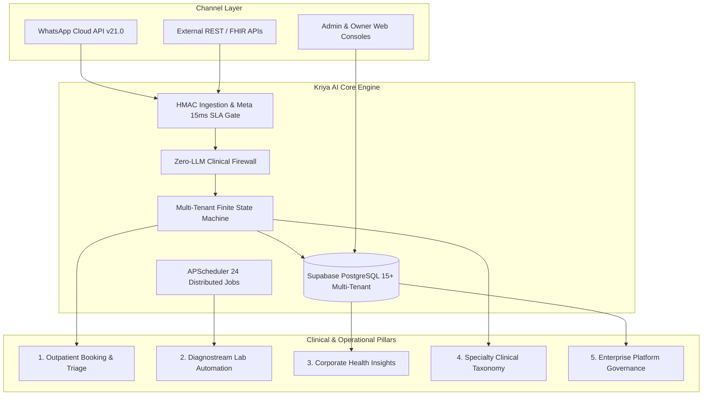

# KRIYA AI — ENTERPRISE AGENTIC OPERATING SYSTEM
## MASTER ARCHITECTURE, CAPABILITIES & MULTI-SECTOR EXPANSION BLUEPRINT

---

**Document Reference:** KAI-MAS-2026-V2  
**Platform Version:** Kriya AI v2.0.0 (Powered by XylarcAI)  
**Classification:** Enterprise Platform Architecture & Sector Expansion Blueprint  
**Author:** Kriya AI Core Engineering Team  
**Compliance Standards:** India DPDP Act 2023 · NMC Medical Ethics · HL7 FHIR R4 · ISO 27001 Security Principles  

---

## 1. Executive Definition: What is Kriya AI?

**Kriya AI** is not a chatbot. It is a **production-grade, multi-tenant Autonomous Operations Operating System** designed to eliminate administrative friction, manual coordination, and siloed software across enterprise facilities. 

While initially engineered to solve the complex operational crises of healthcare (hospitals, multi-specialty surgical clinics, and pathology chains), Kriya AI’s core architecture is an **event-driven, agentic workflow orchestrator**. It transforms ubiquitous conversational channels (primarily WhatsApp, alongside Web Portals and APIs) into a 24/7 autonomous digital front desk and back-office engine.

```
┌─────────────────────────────────────────────────────────────────────────────────────────────┐
│                                   THE CORE VALUE ENGINE                                     │
├─────────────────────────────────────────────────────────────────────────────────────────────┤
│  Conversational Channels  ──►  Deterministic Safety & FSM  ──►  ACID Transactional Ledger   │
│  (WhatsApp / Web / APIs)       (Zero-LLM Firewall + AI)          (Locks / Slots / Payments)  │
│                                           │                                                 │
│                                           ▼                                                 │
│                               24 Autonomous Background Jobs                                 │
│                   (Queue Tokens · Reminders · LIMS Sync · Analytics)                        │
└─────────────────────────────────────────────────────────────────────────────────────────────┘
```

### The Problems Kriya AI Eliminates in Enterprise Facilities
1. **Front-Desk Jamming:** 60%–80% of front-office bandwidth is wasted on repetitive scheduling, availability inquiries, fee questions, and location queries.
2. **Revenue Loss from No-Shows:** Healthcare outpatient departments lose 20% to 35% of booked slots because patients forget or encounter friction. Kriya AI cuts this by over half via automated 24-hour and 2-hour conversational confirmation loops.
3. **Chaotic, Blind Waiting Rooms:** Patients wait 45 to 90 minutes in crowded physical waiting areas without visibility. Kriya AI provides live digital queue tokens on WhatsApp that update in real time.
4. **Siloed Diagnostic Reports:** Patients make physical trips solely to collect paper lab reports. Kriya AI scrapes laboratory systems, validates patient identity, and delivers authenticated PDFs with bilingual, jargon-free AI summaries directly on WhatsApp.
5. **Corporate Screening Camp Overhead:** Corporate clients demand aggregate population health dashboards, but labs are stuck in manual Excel compilation. Kriya AI ingests hundreds of PDF reports in minutes and provisions private corporate HR portals with zero PII stored.

---

## 2. The Architectural Difference: Agentic System vs. Normal Chatbots

The term "chatbot" usually refers to a fragile prompt wrapper around an LLM API. In enterprise environments—especially medical and legal—basic chatbots fail catastrophic liability tests. 

The table below outlines why **Kriya AI is fundamentally an Agentic Operating System**, not a chatbot:

```
┌───────────────────────────┬───────────────────────────────────┬───────────────────────────────────┐
│ ARCHITECTURAL DIMENSION   │ TRADITIONAL CHATBOT               │ KRIYA AI AGENTIC SYSTEM           │
├───────────────────────────┼───────────────────────────────────┼───────────────────────────────────┤
│ Execution Paradigm        │ Reactive & Stateless: Only speaks │ Autonomous & Proactive: Evaluates │
│                           │ when spoken to; forgets context.  │ states, tracks background jobs,   │
│                           │                                   │ fires alerts, and triggers tasks. │
├───────────────────────────┼───────────────────────────────────┼───────────────────────────────────┤
│ State Management          │ Conversational memory dump:       │ Strict Finite State Machine (FSM):│
│                           │ Raw chat history fed into prompt. │ Deterministic stage transitions   │
│                           │ Prone to drift and hallucination. │ (IDLE ➔ DOCTOR ➔ SLOT ➔ PAYMENT). │
├───────────────────────────┼───────────────────────────────────┼───────────────────────────────────┤
│ Clinical / Legal Safety   │ None: Relies on system prompt     │ Zero-LLM Deterministic Firewall:  │
│                           │ "please do not diagnose". Fails   │ Hard-coded regex & taxonomies     │
│                           │ under prompt injection attacks.   │ block prescribing & diagnosis.    │
├───────────────────────────┼───────────────────────────────────┼───────────────────────────────────┤
│ Transactional Guarantees  │ Probabilistic text: "You are      │ ACID-Protected Distributed Locks: │
│                           │ booked for 5 PM" without locking. │ 10-minute temporary holds, CAS    │
│                           │ Massive double-booking risk.      │ row locks, zero race conditions.  │
├───────────────────────────┼───────────────────────────────────┼───────────────────────────────────┤
│ Payments & Settlement     │ Static UPI QR images or payment   │ Dynamic Razorpay Orchestration:   │
│                           │ links with no verification.       │ Webhook verification, auto-refund │
│                           │                                   │ triggers on timeout/cancellation. │
├───────────────────────────┼───────────────────────────────────┼───────────────────────────────────┤
│ Enterprise Integration    │ Siloed chat bubble: No live link  │ Live System Connectors:           │
│                           │ to hospital EMRs or lab machines. │ Bidirectional LIMS, MocDoc,       │
│                           │                                   │ CallMedex, FHIR, and Supabase DB. │
├───────────────────────────┼───────────────────────────────────┼───────────────────────────────────┤
│ Multi-Tenant Security     │ Shared prompts and vector stores; │ Hard Database Tenant Isolation:   │
│                           │ risk of cross-client data leak.   │ Scoped queries on 30 tables, AST  │
│                           │                                   │ linter enforced at compile time.  │
└───────────────────────────┴───────────────────────────────────┴───────────────────────────────────┘
```

### The Three Hallmarks of Kriya AI's Agentic Architecture:

#### 1. Deterministic FSM + Probabilistic LLM Separation
Kriya AI separates **intent extraction** from **business logic execution**:
* An LLM (Groq / OpenRouter / Llama 3.3-70b) is used *only* to interpret user intent from natural language (e.g., extracting symptoms, requested doctor names, or dates in English, Hindi, or Telugu).
* Once the intent is extracted, the LLM is **completely removed from the decision loop**. The transition from `AWAITING_SLOT` to `AWAITING_PAYMENT` is governed by hard Python code in an explicit Finite State Machine (`app/services/fsm.py`).

#### 2. The Zero-LLM Clinical Safety Firewall
Under National Medical Commission (NMC) regulations, AI is strictly prohibited from autonomously diagnosing patients or issuing prescriptions. 
* Kriya AI enforces a **Zero-LLM Clinical Firewall** (`app/services/clinical_firewall.py`).
* Before any prompt reaches an LLM, a deterministic regex and keyword engine inspects the input for emergency markers (e.g., chest pain, severe bleeding, stroke symptoms, pediatric trauma) or requests for drug dosages.
* If triggered, the system instantly halts autonomous processing, returns an emergency escalation response, and directs the user to 108 or hospital emergency staff.

#### 3. Autonomous Proactive Event Loop (APScheduler)
A traditional chatbot dies the second a user stops typing. Kriya AI runs **24 autonomous background worker jobs** governed by distributed PostgreSQL Compare-And-Swap locks (`scheduler_locks`):
* Continuously scans doctor leave tables and automatically cancels/refunds conflicting patient slots.
* Tracks waiting room physical check-ins and pushes live token alerts to WhatsApp.
* Polls external LIS/EMR endpoints (CallMedex, MocDoc) for verified lab reports and pushes them to patients automatically.
* Manages 24-hour and 2-hour appointment confirmation and reminder triggers.

---

## 3. End-to-End Capabilities in Healthcare

Kriya AI is currently organized into five operational pillars across the healthcare delivery spectrum:



---

### Pillar 1: Autonomous Outpatient (OPD) Lifecycle
* **Conversational Scheduling:** Patients book consultations by typing naturally in English, Hindi, or Telugu. No mobile app download or account creation required.
* **Intelligent Department & Doctor Matching:** Maps non-clinical colloquial symptoms (e.g., "my knee clicks when I walk" ➔ Orthopedics; "red rash on forearm" ➔ Dermatology).
* **ACID Slot Reservation Engine:** Prevents double-booking race conditions during high-volume surges by acquiring atomic 10-minute temporary holds on slots during checkout.
* **Cashless Pre-Collection via Razorpay:** Generates dynamic UPI and card payment links directly in WhatsApp; monitors payment webhook callbacks; confirms appointments instantaneously upon settlement.
* **Live Waiting Room Queue Tokens:** Integrates with the physical hospital reception. When a patient arrives and checks in, Kriya AI issues a live digital token number on WhatsApp (e.g., *"You are Token #14. Currently serving #11. Estimated wait: 12 minutes"*).
* **Doctor Leave Automation:** If a doctor marks an emergency leave in their portal, Kriya AI identifies all impacted appointments, initiates automated UPI refunds via Razorpay, and sends WhatsApp messages allowing patients to rebook with a single tap.

---

### Pillar 2: Diagnostream Lab Automation
Diagnostic results are frequently delayed by manual physical collection and congested reception counters:
* **Headless LIMS/EMR Sync:** Connects to laboratory information management systems (such as CallMedex and MocDoc) or scrapes incoming report endpoints.
* **Patient Identity Verification:** Automatically matches lab reports to registered patient records using fuzzy name matching, normalized phone numbers, and lab accession barcode IDs.
* **Authenticated Delivery:** Pushes encrypted, verified PDF reports directly to the patient's WhatsApp conversation as soon as the pathologist signs off.
* **AI Clinical Summaries:** Generates bilingual, patient-friendly, non-diagnostic summaries explaining test results in plain language (e.g., *"Your Hemoglobin is 13.5 g/dL, which is within the normal healthy range"*), while explicitly urging the patient to review findings with their consulting doctor.

---

### Pillar 3: Corporate Health Insights (Executive Health Camps)
*(Built in Session 27, Migrations 095 & 096)*  
Diagnostic centres conduct massive corporate annual wellness screenings for companies like IT firms, banks, and manufacturing plants. Historically, labs could only deliver individual PDF reports, leaving HR teams blind to macro health trends:
* **Managed Batch PDF Ingestion:** Kriya AI ingests folders of 200–500 employee PDF reports in minutes via the Platform Owner Console.
* **Zero-LLM Deterministic Text Parser:** Mathematical regex parsing extracts 18 clinical parameters across 6 panels (CBC, Diabetes, Lipid, LFT, KFT, Vitamins & Thyroid) with 100% precision and zero AI hallucination.
* **Dynamic Sex-Specific Reference Ranges:** Captures the lab's exact reference thresholds directly from the report text (e.g., Hemoglobin normal bands for males vs. females).
* **DPDP Act 2023 Compliance:** **Zero Raw-PDF Storage and Zero PII Storage**. Employee names, phones, and raw files are discarded immediately after in-memory parsing (~0.6 KB per record stored).
* **Dedicated Corporate HR Portals (`CORPORATE_VIEWER`):** Generates isolated logins for company HR leadership. HR can cross-filter population health by age and gender cohorts, view metabolic syndrome risk curves, and export board-level presentations.
* **Small-Cohort Privacy Guard:** Automatically banners and protects filtered sub-cohorts smaller than 10 individuals to prevent accidental deanonymization.

---

### Pillar 4: Multi-Specialty Clinical Taxonomy Modules
Rather than forcing all medical practices into a generic "department-doctor" paradigm, Kriya AI provides specialized vertical modules tailored to specific clinical workflows:

```
┌─────────────────────────────────┬───────────────────────────────────────────────────────────┐
│ SPECIALTY VERTICAL              │ SPECIALIZED CLINICAL TAXONOMY & WORKFLOWS                 │
├─────────────────────────────────┼───────────────────────────────────────────────────────────┤
│ Dermatology & Trichology        │ • Procedure discovery: Chemical Peels, Laser Hair, MNRF.  │
│ (`derma`)                       │ • Hair PRP/GFC therapy workflows, pre-procedure guidance. │
│                                 │ • AI 2-line clinical hooks explaining treatment benefits. │
├─────────────────────────────────┼───────────────────────────────────────────────────────────┤
│ Ophthalmology & Eye Care        │ • Specs removal concierge: Contoura Vision, LASIK, SMILE. │
│ (`eye`)                         │ • Robotic Laser Cataract Surgery & premium IOL guidance.  │
│                                 │ • Diabetic Retinopathy screening & glaucoma triage.       │
├─────────────────────────────────┼───────────────────────────────────────────────────────────┤
│ Dental Surgery & Orthodontics   │ • Single-sitting rotary RCT vs. Invisible Clear Aligners. │
│ (`dental`)                      │ • Dental Implantology (Single tooth, All-on-4 full arch). │
│                                 │ • Cosmetic dentistry: Veneers, Teeth Whitening, CAD/CAM.  │
├─────────────────────────────────┼───────────────────────────────────────────────────────────┤
│ IVF & Reproductive Medicine     │ • IVF cycle counseling, egg freezing, ICSI workflows.     │
│ (`ivf`)                         │ • High-empathy conversational pacing, privacy shields.    │
├─────────────────────────────────┼───────────────────────────────────────────────────────────┤
│ Women & Child Specialty         │ • Integrated Obstetrics, Gynecology, Pediatrics, and      │
│ (`women_child`)                 │   Vaccination scheduling schedules.                       │
└─────────────────────────────────┴───────────────────────────────────────────────────────────┘
```

---

### Pillar 5: Enterprise Governance & Operations Consoles
* **Clinic Administrator Dashboard (`admin/index.html`):** 18 specialized tabs including Live Appointments, Doctor Rosters, Department Catalogs, Patient Directory, Billing & Invoicing, Staff Permissions, and Corporate Health.
* **Platform Owner Console (`admin/platform.html`):** Platform-level super-admin console providing multi-tenant provisioning, subscription tiers (`standard`, `specialty`, `diagstream`, `corporate_partner`), feature overrides, AI budget spend caps, and audit logs.
* **Granular Role-Based Access Control (RBAC):** Strict separation between `super_admin`, `admin`, `doctor`, `receptionist`, `telecaller`, `staff`, and `CORPORATE_VIEWER`.
* **Outbound Broadcast Engine:** Broadcast messaging for patient health education and camp notifications with built-in opt-out handling (replying "STOP" immediately revokes marketing consent).

---

## 4. Technical Topology & Core Invariants

The reliability of Kriya AI rests on strict non-negotiable operational invariants embedded into the codebase:

```
┌───────────────────────────────────┬─────────────────────────────────────────────────────────┐
│ ARCHITECTURAL INVARIANT           │ TECHNICAL IMPLEMENTATION & ENFORCEMENT                  │
├───────────────────────────────────┼─────────────────────────────────────────────────────────┤
│ Meta 20-Second Webhook SLA        │ Inbound webhooks (`POST /webhook`) persist payload to   │
│                                   │ `inbound_messages` and return HTTP 200 within 15ms.     │
│                                   │ Processing occurs asynchronously off the ingest thread. │
├───────────────────────────────────┼─────────────────────────────────────────────────────────┤
│ Database Event Loop Offloading    │ PostgREST Python SDK is synchronous blocking HTTP. All  │
│                                   │ queries are wrapped in `await sb(...)` running inside a │
│                                   │ dedicated `_DB_EXECUTOR` thread pool.                   │
├───────────────────────────────────┼─────────────────────────────────────────────────────────┤
│ PostgREST HTTP/1.1 Monkey Patch   │ PostgREST connection is monkey-patched to force         │
│                                   │ HTTP/1.1; eliminates HTTP/2 stream multiplex resets.   │
├───────────────────────────────────┼─────────────────────────────────────────────────────────┤
│ Multi-Tenancy in Code (RLS Bypass)│ Supabase connection runs as `service_role` (BYPASSRLS). │
│                                   │ Multi-tenancy is enforced on all 30 tenant tables via   │
│                                   │ `scoped_query(table, clinic_id)`. AST linter fails build│
│                                   │ if an unscoped query is introduced.                     │
├───────────────────────────────────┼─────────────────────────────────────────────────────────┤
│ Distributed Concurrency Locking   │ Distributed jobs use atomic CAS row locking on          │
│                                   │ `scheduler_locks` with 10-minute heartbeat TTLs to      │
│                                   │ prevent multi-worker overlapping execution.             │
├───────────────────────────────────┼─────────────────────────────────────────────────────────┤
│ Timezone Pinning                  │ All business logic and scheduler tasks are pinned to    │
│                                   │ Indian Standard Time (`Asia/Kolkata`).                  │
└───────────────────────────────────┴─────────────────────────────────────────────────────────┘
```

---

## 5. Master Expansion Blueprint: Adapting Kriya AI Beyond Healthcare

The foundational infrastructure of Kriya AI—**Conversational Ingestion + Deterministic FSM + Domain Safety Firewall + ACID Slot/Resource Engine + Payment Ledger + Multi-Tenant Isolation + Concierge Analytics**—is not hardcoded to medicine. It is a universal architecture for high-stakes enterprise service industries.

```
┌─────────────────────────────────────────────────────────────────────────────────────────────┐
│                           THE REUSABLE KRIYA AI PLATFORM CORE                               │
├─────────────────────────────────────────────────────────────────────────────────────────────┤
│ • Meta WhatsApp Cloud API Channel Ingest (15ms SLA Gate)                                    │
│ • State Machine (FSM) Workflow Orchestrator                                                 │
│ • ACID Resource Reservation & Anti-Double-Booking Engine                                    │
│ • Dynamic Razorpay Payment Settlement & Automated Refunds                                   │
│ • Distributed APScheduler Engine with PostgreSQL CAS Row Locking                            │
│ • Multi-Tenant Enterprise Isolation (AST Linter Enforced)                                   │
│ • Dual-Console Topology: Platform Owner Console + Client Tenant Dashboards                  │
├─────────────────────────────────────────────────────────────────────────────────────────────┤
│                                  PLUGGABLE VERTICAL ADAPTERS                                │
│        ▼                            ▼                           ▼                           │
│   HEALTHCARE OS             LEGAL & TAX OS             FINANCIAL CLAIMS OS                  │
│   (Current)                 (Law Firms / CA)           (Insurance / Loans)                  │
│   • Clinical Firewall       • Conflict Firewall        • Risk Underwriting Firewall         │
│   • Doctor / Slot Roster    • Partner Billable Slots   • Claim Adjudication Workflow        │
│   • LIMS Report Extraction  • Legal Document Parser    • Insurance Policy Analytics         │
│   • Corporate Health Portal • Client Matter Portal     • Corporate Risk Portal              │
└─────────────────────────────────────────────────────────────────────────────────────────────┘
```

Below is the sector-by-sector translation blueprint demonstrating how Kriya AI expands into new enterprise markets:

---

### Sector 1: Legal Practice & Corporate Compliance OS (`Kriya Legal`)
* **The Industry Friction:** Law firms and Chartered Accountant (CA) firms waste thousands of billable partner hours screening unqualified inquiries, coordinating initial consults, chasing retainer payments, and assembling compliance filings.
* **How Kriya AI Solves It:**
  1. **Conflict-of-Interest & Legal Advice Firewall:** Deterministic firewall screens incoming messages. Blocks unauthorized legal advice; screens opposing parties against existing client matter tables.
  2. **Retainer Consultation Booking:** Qualifies case practice areas (Corporate, Real Estate, Litigation, Tax); books consultation slots against partner calendars with automated Razorpay retainer pre-collection.
  3. **Hearing & Limitation Date Alert Agent:** Autonomous background workers monitor court filing deadlines and hearing dates, alerting litigation clients on WhatsApp.
  4. **Corporate Compliance Document Portal:** Ingests audited balance sheets and MCA filings via the deterministic parser, delivering compliance risk scores to corporate boards.

---

### Sector 2: Financial Services, Insurance & Wealth Advisory (`Kriya Finance`)
* **The Industry Friction:** High drop-off during insurance policy underwriting, friction in filing claims, chaotic document submission, and zero real-time visibility for policyholders.
* **How Kriya AI Solves It:**
  1. **Policyholder KYC & Claim Intake Agent:** Guides policyholders step-by-step through WhatsApp to submit claim bills, discharge summaries, and incident photos with automated deduplication.
  2. **Deterministic Risk Stratification:** In-memory parser extracts key financial and health parameters from claim documents without storing raw confidential PDFs.
  3. **Group Insurance Corporate Portal:** Similar to the Corporate Health Insights module, delivers macro wellness and claim utilization dashboards to corporate HR leadership for corporate health insurance negotiations.
  4. **Autonomous Advisor Scheduling:** Matches high-net-worth clients with certified financial planners based on portfolio size and investment intent.

---

### Sector 3: Higher Education & University Admissions (`Kriya Edu`)
* **The Industry Friction:** University admissions offices are overwhelmed by tens of thousands of WhatsApp and phone inquiries during admission seasons; high counselor attrition and lost applicant leads.
* **How Kriya AI Solves It:**
  1. **Eligibility & Program Qualification Agent:** Conversational qualification across undergraduate and postgraduate programs based on entrance scores, eligibility criteria, and fee structures.
  2. **Campus Tour & Interview Booking:** Real-time slot allocation for departmental interviews and physical campus tours with anti-double-booking locks.
  3. **Application Fee Pre-Collection:** Direct collection of prospectus and entrance examination fees through WhatsApp UPI integration.
  4. **Admissions Committee Analytics Portal:** Ingests high school transcripts and standardized scorecards; delivers aggregate applicant cohort statistics to university deans.

---

### Sector 4: Real Estate, Facility Management & Hospitality (`Kriya Estates`)
* **The Industry Friction:** Real estate developers and commercial facility managers suffer from unverified property walkthrough inquiries, missed tenant service tickets, and fragmented rent collection.
* **How Kriya AI Solves It:**
  1. **Site Walkthrough Scheduling:** Synchronizes sales executive calendars across multiple property sites; books verified buyer visits with automated 24h WhatsApp confirmation loops.
  2. **Tenant Maintenance Ticket Agent:** Tenants photograph and report facility issues on WhatsApp; Kriya AI auto-triages tickets (Plumbing, Electrical, HVAC) and dispatches vendor tokens.
  3. **Rent Collection & Service Ledger:** Pushes automated monthly maintenance invoices on WhatsApp with one-tap payment links, reconciling settlements in real time.
  4. **Facility Occupancy & Analytics Portal:** Real-time visibility into maintenance turnaround times, tenant satisfaction indices, and rent collection health for asset owners.

---

### Sector 5: Municipal & Public Civic Services (`Kriya Civic`)
* **The Industry Friction:** Municipal corporations struggle with crowded citizen service centers, untracked grievance complaints, and opaque administrative appointment queues.
* **How Kriya AI Solves It:**
  1. **Public Grievance Ticketing:** Citizens report municipal issues (road damage, sanitation, water supply) on WhatsApp with geo-tagging. Kriya AI assigns unique digital tracking tokens.
  2. **Citizen Service Slot Booking:** Books fixed-window appointment slots for passport verification, property registration, or trade licenses, eliminating citizen waiting queues.
  3. **Autonomous Public Notifications:** Broadcasts emergency civic alerts, water maintenance schedules, and tax deadlines with strict user consent verification.
  4. **Administrative Leadership Dashboard:** Macro heatmap tracking ward-level grievance resolution times and citizen satisfaction metrics for municipal commissioners.

---

## 6. Technical Migration Roadmap for New Sectors

To launch Kriya AI in any new sector, the engineering team follows a modular **3-layer adaptation pattern**:

```
┌─────────────────────────────────────────────────────────────────────────────┐
│                    NEW SECTOR ADAPTATION CHECKLIST (3 WEEKS)                │
├─────────────────────┬───────────────────────────────────────────────────────┤
│ Layer 1: Firewall   │ Define the industry's forbidden topics and emergency   │
│ & Domain Rules      │ conditions. (e.g., Legal: No unauthorized advice;     │
│ (Days 1–4)          │ Finance: No stock tips; Education: Zero score fraud). │
├─────────────────────┼───────────────────────────────────────────────────────┤
│ Layer 2: Entity &   │ Configure domain entities (e.g., Doctors ➔ Attorneys  │
│ Taxonomy Schema     │ / Advisors; Departments ➔ Practices / Programs;       │
│ (Days 5–10)         │ Treatments ➔ Services / Case Types).                  │
├─────────────────────┼───────────────────────────────────────────────────────┤
│ Layer 3: Extraction │ Calibrate the regex/parser engine for sector-specific  │
│ & Client Portals    │ documents (e.g., Claim bills, court orders, mark-     │
│ (Days 11–18)        │ sheets) and configure executive client portals.       │
├─────────────────────┼───────────────────────────────────────────────────────┤
│ Production Go-Live  │ Run security matrices, AST tenant isolation linter,   │
│ (Day 21)            │ and deploy isolated sector tenant partition.         │
└─────────────────────┴───────────────────────────────────────────────────────┘
```

---

## 7. Summary & Strategic Conclusion

**Kriya AI is an enterprise infrastructure platform.** It succeeds because it refuses to be a generic conversational toy. By binding natural language to **rigid Finite State Machines, deterministic safety firewalls, distributed PostgreSQL concurrency locks, live system connectors, and privacy-first analytics**, Kriya AI delivers measurable operational efficiency.

Having proven zero-downtime, production-grade reliability across complex clinical hospitals and diagnostic networks, the platform is architecturally equipped for rapid horizontal expansion across legal, financial, educational, and civic enterprise sectors.

---

*Authored by the Kriya AI Platform Architecture Team · Confidential Enterprise Asset*
