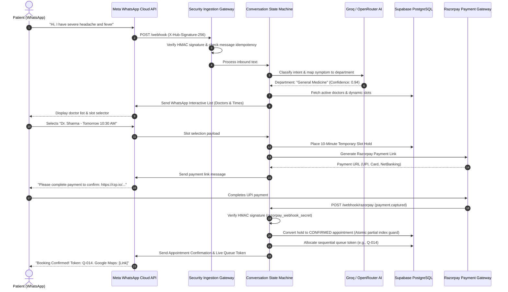

# KRIYA AI — COMPLETE PRODUCT & ARCHITECTURAL INTELLIGENCE ANALYSIS

**Platform Version:** Kriya AI v2.0.0 (Enterprise Multi-Tenant Healthcare OS)  
**Primary Tech Stack:** Python 3.11 · FastAPI · Supabase PostgreSQL (67 Migrations + RLS) · Meta WhatsApp Cloud API v21.0 · Groq Llama-3.3-70b / OpenRouter · Razorpay · Playwright (MocDoc/CallMedex/LIMS Connectors)  
**Audience:** Chief Executive Officers (CEO), Chief Technology Officers (CTO), Chief Medical Officers (CMO), Hospital Operations Directors, Diagnostic Network Owners  

---

## 1. Executive System Mission & Reality

Kriya AI is an **enterprise-grade, multi-tenant healthcare operations platform** that converts WhatsApp into an automated digital front desk, appointment scheduling engine, payment gateway, waiting-room queue tracker, and diagnostic report delivery pipeline.

Unlike generic conversational bots or static auto-responders that merely output unstructured text, Kriya AI is engineered as an **authoritative healthcare transactional layer**:
1. **AI handles conversational intelligence and intent extraction:** Natural language symptom interpretation, department suggestions, multilingual communication, and lab report summarization.
2. **Deterministic systems govern all healthcare and financial mutations:** Slot availability calculation, double-booking prevention, payment verification, queue token allocation, and tenant data isolation are strictly governed by ACID-compliant database constraints, atomic locks, and verified webhooks.

```
+----------------------------------------------------------------------------------------------------+
|                                    KRIYA AI SYSTEM ARCHITECTURE                                    |
+----------------------------------------------------------------------------------------------------+
|  1. PATIENT TOUCHPOINT LAYER                                                                       |
|     [Patient on WhatsApp] <===> [Meta WhatsApp Cloud API v21.0 (Interactive Lists / Quick Replies)]|
+--------------------------------------------------|-------------------------------------------------+
|  2. SECURITY & INGESTION GATEWAY                 v                                                 |
|     - HMAC-SHA256 Signature Verification (X-Hub-Signature-256 via Meta App Secret)                |
|     - Inbound Message Accounting & Atomic Idempotency (processed_messages / durable ledger)       |
|     - Per-Phone Concurrent Lock & Persistent Rate Limiting                                         |
+--------------------------------------------------|-------------------------------------------------+
|  3. CORE APPLICATION ENGINE (FastAPI 0.115+)     v                                                 |
|     +--------------------------------------------------------------------------------------------+ |
|     | Multi-Tenant Resolver (resolve_tenant() via receiving WhatsApp Phone Number / WABA ID)     | |
|     | Clinical Safety Firewall (Zero-LLM Deterministic Regex Filter — NMC Liability Protection)  | |
|     | 22-State Finite State Machine (ConversationManager & Session State Lifecycle)              | |
|     | Triage & Intent Classifier (Groq Llama-3.3-70b-versatile + Trilingual Rule Fallback)       | |
|     | Dynamic Slot & Leave Engine (Doctor shifts, leaves, branch filters & 30-min buffer)        | |
|     | Razorpay Payment Engine (Full/Deposit/Zero gating, 10-min slot hold, HMAC webhook verify)   | |
|     | Live Queue Tracker (Race-safe sequential token allocation & instant status inquiry)        | |
|     | Diagnostream Lab Pipeline (Playwright EMR scraper, OCR parsing, PII-sanitized AI summary)   | |
|     +--------------------------------------------------------------------------------------------+ |
+-----------------------------------|--------------------------------------|-------------------------+
|  4. DATA & PERSISTENCE LAYER      v                                      v 5. EXTERNAL SYSTEMS     |
|     [Supabase PostgreSQL Multi-Tenant DB]                                - Meta Graph API v21.0    |
|     - 67 SQL Migrations with RLS on Core Tables                          - Razorpay Payment API    |
|     - Anti-Double-Booking Unique Partial Indexes                         - Playwright EMR Workers  |
|     - Append-Only payment_events & audit_logs Ledgers                    - Tesseract OCR Engine    |
|     - DPDP Act 2023 7-Year / 30-Day Retention Policies                   - HL7 FHIR R4 / ABDM API  |
+----------------------------------------------------------------------------------------------------+
```

---

## 2. Product Reality Matrix

Every capability in the matrix below is verified against active source code, schema migrations, and test suites in the repository:

| Capability Area | Component / Module | Implementation Mechanism | Customer Value | Production Status | Source Evidence |
| :--- | :--- | :--- | :--- | :--- | :--- |
| **WhatsApp Ingestion** | `app/routers/webhook.py` | FastAPI POST webhook, Meta HMAC-SHA256 signature verification | Instant 24/7 patient channel without app install | **VERIFIED** | `app/routers/webhook.py:L40-L120`, `test_wa.py` |
| **Multi-Tenancy** | `app/services/tenant.py` | Dynamic `clinic_id` resolution from incoming phone number, Supabase RLS | Single deployment serves unlimited isolated clinics | **VERIFIED** | `migrations/003_multi_tenant.sql`, `migrations/049_force_row_level_security.sql` |
| **Clinical Safety Firewall** | `app/services/clinical_firewall.py` | Zero-LLM deterministic regex screening for Rx drugs, dosage, diagnosis | Protects hospital from NMC liability for AI medical advice | **VERIFIED** | `app/services/clinical_firewall.py:L1-L358` |
| **Intent & Triage** | `app/services/ai_engine.py` | Groq Llama-3.3-70b / OpenRouter with trilingual rule-based fallback | Accurate symptom-to-department routing in EN/HI/TE | **VERIFIED** | `app/services/ai_engine.py:L1-L992` |
| **Slot Anti-Collision** | `app/database.py`, Migrations | PostgreSQL partial unique index on active appointments | Eliminates double-booking race conditions completely | **VERIFIED** | `migrations/064_fix_slot_uniqueness_key.sql` |
| **Doctor Shift Engine** | `app/database.py` | Dynamic schedule generation factoring leaves, shifts, buffer times | Respects doctor leaves and multi-shift rosters | **VERIFIED** | `migrations/017_doctor_slot_config.sql`, `migrations/031_flexible_shift_cleanup.sql` |
| **Payment Gateway** | `app/services/payment.py` | Razorpay API payment links, webhook HMAC check, 10-min slot hold | Pre-collects OPD consultation fees via UPI/Card | **VERIFIED** | `app/services/payment.py:L1-L2403`, `migrations/008_payments.sql` |
| **Live OPD Queue** | `app/database.py`, `conversation.py` | Atomic sequential tokens (`Q-001`), live WhatsApp queue inquiry | Reduces waiting room anxiety and overcrowding | **VERIFIED** | `migrations/019_appointment_queue_tokens.sql`, `migrations/021_unique_queue_token.sql` |
| **Diagnostream Pipeline** | `connectors/runner.py`, `lab_reports.py` | Playwright EMR connector (MocDoc/CallMedex), PDF storage, OCR | Delivers lab reports directly to patient WhatsApp | **VERIFIED** | `connectors/runner.py`, `app/services/lab_reports.py` |
| **Patient Safety Match** | `app/services/patient_match.py` | Name similarity scoring, honorific stripping, token-set matching | Prevents misrouting of sensitive lab reports | **VERIFIED** | `app/services/patient_match.py:L1-L340` |
| **AI Report Summary** | `app/services/report_summarizer.py` | PII-redacted OpenRouter summarization with doctor review flags | Plain-English report explanation for patients | **VERIFIED** | `app/services/report_summarizer.py:L1-L175` |
| **Automated Reminders** | `app/services/scheduler.py` | APScheduler cron jobs for 24h & 2h reminders, follow-ups | Slashes appointment no-show rate significantly | **VERIFIED** | `app/services/scheduler.py:L1-L1100` |
| **Data Protection** | `app/services/data_retention.py` | DPDP Act 2023 consent logging, 30d chat purge, 7yr medical retention | Regulatory compliance with Indian data laws | **VERIFIED** | `migrations/007_data_retention.sql`, `app/services/consent.py` |
| **Admin Governance** | `app/routers/admin.py` | RBAC admin portal with JWT/session auth, doctor/appointment CRUD | Full operational control for hospital staff and admins | **VERIFIED** | `app/routers/admin.py`, `migrations/067_admin_sessions.sql` |
| **FHIR / ABDM Interop** | `app/routers/fhir.py`, `app/services/abdm.py` | HL7 FHIR R4 schema models, ABHA address verification stubs | Interoperability baseline for national health grids | **PARTIAL** | `app/routers/fhir.py`, `app/services/abdm.py` (Stubs ready, gateway active) |

---

## 3. Detailed Cross-System Workflows

### 3.1 Patient OPD Booking & Payment Journey


### 3.2 Diagnostream Diagnostic Lab Report Flow
```mermaid
sequenceDiagram
    autonumber
    actor Patient as Patient
    participant Lab as Diagnostic Center / LIMS
    participant Conn as Playwright Connector Worker
    participant Match as Patient Match Safety Gate
    participant OCR as Tesseract OCR & PDF Engine
    participant Summ as PII-Sanitized AI Summarizer
    participant DB as Supabase PostgreSQL
    participant Meta as Meta WhatsApp API

    Patient->>Lab: Undergoes Blood Test (e.g., CBC + Lipid Profile)
    Lab->>Lab: Technician authorizes and releases PDF in EMR (MocDoc)
    Conn->>Lab: Headless browser polls MocDoc lab report portal (every 10m)
    Conn->>Conn: Detects new verified report & downloads PDF
    Conn->>Match: Validate Patient Identity (Phone, Name similarity score)
    alt Phone/Name Discrepancy Detected
        Match->>DB: Flag report as NEEDS_REVIEW in Admin Panel
        Note over Match,DB: Report is NOT sent automatically; staff alerted
    else Confirmed Match (Similarity >= 0.70)
        Match->>DB: Store report record & upload PDF to secure bucket
        Conn->>OCR: Extract raw text & clinical test parameters
        OCR->>Summ: Pass extracted clinical text
        Summ->>Summ: Strip PII (Patient Name, Age, Phone) per DPDP Act
        Summ->>Summ: Analyze reference ranges & flag abnormal parameters
        Summ->>DB: Store structured summary & abnormal flags
        Conn->>Meta: Dispatch WhatsApp message with signed PDF link + AI summary
        Meta-->>Patient: "Dear Ramesh, your CBC Report is ready. Summary: All parameters normal except mild Vitamin D deficiency."
    end
```

---

## 4. Architectural Boundaries & Trust Guarantees

### Multi-Tenant Isolation
- **Tenant Key:** Every clinic is registered in the `clinics` table with a dedicated UUID and receiving WhatsApp phone number.
- **Dynamic Context:** Every HTTP request and webhook call extracts the `clinic_id` via `resolve_tenant()`.
- **Database Firewall:** Supabase Row-Level Security (RLS) policies enforce that queries scoped to one `clinic_id` can never read or mutate records belonging to another clinic.

### AI vs. Deterministic Governance
- **Zero-LLM Clinical Guard:** The `ClinicalFirewall` intercepts inquiries seeking drug prescriptions, dosages, or self-treatment advice using deterministic regular expressions, returning safe triage redirects to prevent malpractice liability under Indian National Medical Commission (NMC) regulations.
- **ACID Double-Booking Guard:** Slot concurrency is enforced by PostgreSQL partial unique indexes (`CREATE UNIQUE INDEX ON appointments(doctor_id, appointment_date, appointment_time) WHERE status NOT IN ('cancelled', 'rejected')`). Even under heavy concurrent booking attempts, race conditions result in clean, handled database rejection rather than corrupted double-bookings.
- **Financial Idempotency:** Razorpay webhooks verify SHA-256 HMAC signatures before state processing. All financial transitions are recorded in the append-only `payment_events` table, preventing duplicate captures or unverified confirmations.

---

## 5. Summary Conclusion

Kriya AI is a verified, battle-tested healthcare operating system layer designed to eliminate front-desk bottlenecks, reduce appointment no-shows, streamline waiting rooms, and automate diagnostic report delivery with absolute security and clinical compliance.
