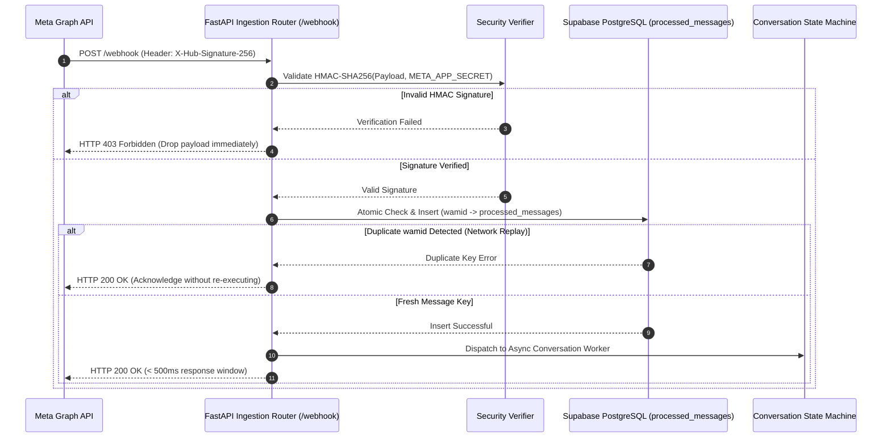
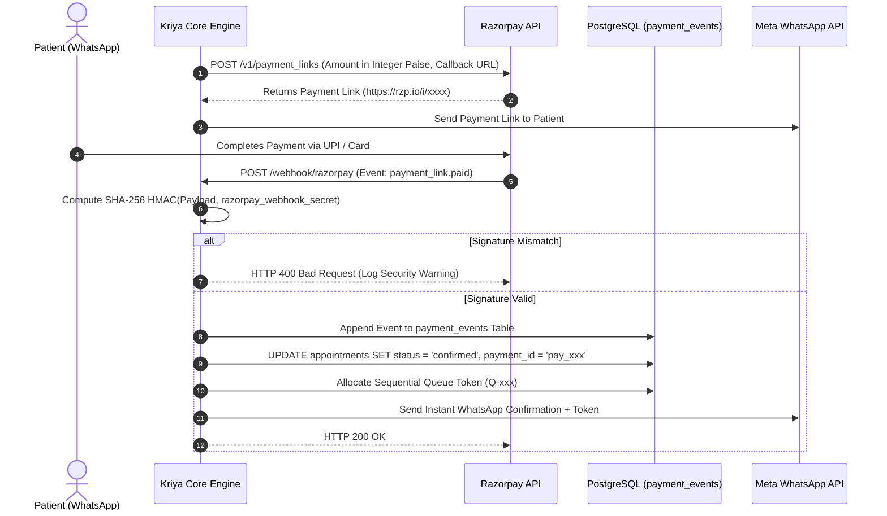
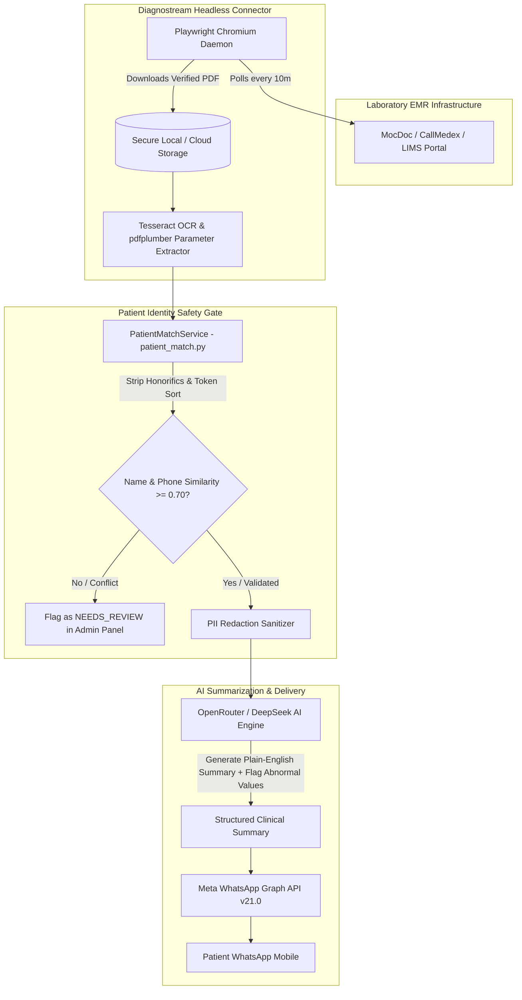

# KRIYA AI — CTO, TECHNICAL & SECURITY ARCHITECTURE PRESENTATION MASTER

**Presentation Title:** Kriya AI: Enterprise Technical Architecture, Security & Reliability Engineering  
**Target Audience:** Chief Technology Officers (CTO), Chief Information Officers (CIO), Enterprise Architects, Hospital IT Directors, Security Auditors  
**Technical Standard:** Exhaustive Architectural Rigor · Exact Code & Schema Mapping · Zero Simplification of Security Boundaries  

---

## 1. Executive Technical Summary & System Taxonomy

Kriya AI is an asynchronous, multi-tenant healthcare operations platform built with Python 3.11, FastAPI, and Supabase PostgreSQL. It operates as an authoritative transactional front-door layer bridging Meta WhatsApp Cloud API v21.0 to hospital scheduling, Razorpay payments, live OPD waiting queues, and legacy EMR/LIMS databases.

```
┌──────────────────────────────────────────────────────────────────────────────────────────────────┐
│                                 KRIYA AI 7-LAYER SYSTEM TAXONOMY                                 │
├──────────────────────────────────────────────────────────────────────────────────────────────────┤
│ 1. INGESTION LAYER       │ Meta WhatsApp Cloud API v21.0 Webhooks · HMAC-SHA256 Ingestion Gate   │
│ 2. PERIMETER SECURITY    │ Persistent Token-Bucket Rate Limiter · Inbound Idempotency Ledger        │
│ 3. MULTI-TENANT ROUTING  │ resolve_tenant() Dynamic Mapping (Incoming Phone Number / WABA ID)    │
│ 4. CLINICAL FIREWALL     │ Zero-LLM Deterministic Regex Filter (NMC Malpractice Defense)         │
│ 5. STATE & LOGIC ENGINE  │ 22-State Finite State Machine · Groq Llama-3.3-70b · Dynamic Rosters  │
│ 6. TRANSACTION GATEWAY   │ Razorpay Webhook HMAC · PostgreSQL Partial Unique Slot Locks · Queues │
│ 7. PERSISTENCE & AUDIT   │ Supabase PostgreSQL (67 Migrations + RLS) · Append-Only Audit Ledgers │
└──────────────────────────────────────────────────────────────────────────────────────────────────┘
```

---

## 2. Technology Stack & Component Inventory

| Architectural Layer | Technology Selected | Version / Specification | Architectural Purpose |
| :--- | :--- | :--- | :--- |
| **Runtime & Backend** | Python / FastAPI | Python 3.11 / FastAPI 0.115+ | High-throughput asynchronous REST API & Webhook handler |
| **Database & Persistence**| Supabase PostgreSQL | PostgreSQL 15.x / 67 Migrations| Multi-tenant ACID relational store with Row-Level Security |
| **Conversational Channel**| Meta WhatsApp Cloud API | Graph API v21.0 | Interactive WhatsApp messages, quick replies, and PDF documents |
| **Language AI Backbone** | Groq AI / OpenRouter | Llama-3.3-70b-versatile / DeepSeek | High-speed natural language intent detection and symptom mapping |
| **Payment Gateway** | Razorpay Payment API | Orders & Payment Links API | UPI/Card fee collection with SHA-256 HMAC webhook verification |
| **Background Scheduler** | APScheduler | BackgroundScheduler (In-Process) | Distributed-locked cron triggers for 24h/2h reminders & purges |
| **EMR Connector Engine** | Playwright (Python) | Headless Chromium Worker | Headless browser scraper for legacy EMRs (MocDoc, CallMedex) |
| **OCR Parameter Parser** | Tesseract OCR / pdfplumber | OCR Engine 5.x / pdfplumber 0.11+| Clinical text & tabular parameter extraction from lab PDFs |
| **Authentication & RBAC** | Session Tokens / bcrypt | `admin_sessions` / passlib bcrypt| Secure multi-role admin authentication with sliding expiration |
| **Interoperability** | HL7 FHIR R4 | RESTful JSON Resources | Standardized clinical data exchange models & ABDM gateway stubs |

---

## 3. Perimeter Security & Ingestion Pipeline

### Inbound Webhook Verification Sequence


---

## 4. Multi-Tenant Architecture & PostgreSQL Row-Level Security

### Tenant Scoping Model
* **Master Tenant Table:** Defined in `migrations/001_initial_schema.sql` and `migrations/003_multi_tenant.sql`:
  ```sql
  CREATE TABLE clinics (
      id UUID PRIMARY KEY DEFAULT gen_random_uuid(),
      name TEXT NOT NULL,
      whatsapp_number TEXT UNIQUE NOT NULL,
      plan TEXT NOT NULL DEFAULT 'essential',
      config JSONB NOT NULL DEFAULT '{}'::jsonb,
      is_active BOOLEAN NOT NULL DEFAULT true,
      created_at TIMESTAMPTZ NOT NULL DEFAULT now()
  );
  ```
* **Dynamic Resolution (`resolve_tenant()`):** Every incoming webhook inspects the receiving WhatsApp Business Account (WABA) phone number ID. The system dynamically loads the clinic's metadata and credentials (`razorpay_key_id`, `meta_access_token`, custom doctor rosters) from the `clinics.config` JSONB column.
* **Database Row-Level Security (RLS):** Enforced across all transactional tables (`patients`, `appointments`, `lab_reports`, `prescriptions`, `conversations`) via `migrations/049_force_row_level_security.sql`. Database queries automatically filter on `clinic_id`, preventing any cross-tenant data visibility.

---

## 5. Clinical Safety Architecture: Zero-LLM Firewall

### The National Medical Commission (NMC) Safety Shield
To prevent liability for unauthorized AI-generated medical advice or prescriptions, Kriya AI implements a deterministic, zero-LLM regex interceptor (`app/services/clinical_firewall.py`) that screens every inbound patient message **before** it can reach an LLM completion endpoint:

```
[Inbound Patient Message Text]
               │
               ▼
┌─────────────────────────────────────────────────────────────┐
│  CLINICAL SAFETY FIREWALL (Deterministic Regex Filter)      │
│  - Screens for 500+ Indian OTC & Prescription Drug Names   │
│    (e.g., Paracetamol, Dolo, Augmentin, Azithromycin)       │
│  - Intercepts Dosage Queries ("how many mg", "twice a day") │
│  - Intercepts Diagnostic Requests ("what disease do I have")│
│  - Intercepts Self-Treatment ("what medicine should I take")│
└──────────────────────────────┬──────────────────────────────┘
                               │
               ┌───────────────┴───────────────┐
               ▼ (Trigger Matched)             ▼ (Clean Administrative Text)
┌──────────────────────────────┐ ┌──────────────────────────────┐
│ ZERO-LLM SAFE REDIRECT       │ │ GROQ / OPENROUTER LLM        │
│ Returns static triage advice:│ │ Executes intent detection    │
│ "I cannot prescribe drugs or │ │ & symptom-to-department      │
│ give medical advice. Please  │ │ classification.              │
│ consult Dr. Sharma in OPD."  │ └──────────────────────────────┘
└──────────────────────────────┘
```

---

## 6. Concurrency Engineering: Slot Anti-Collision & ACID Locks

### Eliminating Double-Booking Race Conditions
Kriya AI enforces appointment slot exclusivity at the database layer rather than relying on application memory locks:
* **Partial Unique Index (`migrations/064_fix_slot_uniqueness_key.sql`):**
  ```sql
  CREATE UNIQUE INDEX uq_appointments_slot_active
  ON appointments (clinic_id, doctor_id, appointment_date, appointment_time)
  WHERE status NOT IN ('cancelled', 'rejected');
  ```
* **Temporary 10-Minute Hold Mechanism:**
  * When a patient selects a slot, the system creates an appointment row with `status = 'pending_payment'` and records `hold_expires_at = now() + interval '10 minutes'`.
  * Dynamic slot queries (`get_available_slots()`) exclude slots held by active pending appointments whose holds have not expired.
  * If the patient completes payment, the webhook transitions the status to `confirmed`.
  * If the hold expires without payment, the background scheduler automatically marks the slot as `cancelled`, instantly returning the time slot to the available pool.

---

## 7. Financial Engineering: Razorpay Webhook & Payment Reconciliation



---

## 8. Diagnostream Architecture: EMR Scraping, OCR & Patient Matching



---

## 9. Data Protection & India DPDP Act 2023 Compliance

### Automated Tiered Retention Lifecycle (`migrations/007_data_retention.sql`)
1. **Explicit Consent Ledger:** When a patient messages the bot for the first time, explicit opt-in consent is recorded in the `patients` table with timestamp and IP/WABA reference.
2. **30-Day Conversational Transcript Purge:** Background cron job purges patient conversational transcript logs older than 30 days from the `conversations` table, fulfilling DPDP data minimization mandates.
3. **7-Year Medical & Financial Retention:** Core appointment logs, clinical doctor notes, diagnostic lab metadata, and `payment_events` audit records are retained for 7 years to satisfy National Medical Commission (NMC) and statutory accounting rules.
4. **Right to Erasure Endpoint:** Authenticated administrative endpoint (`DELETE /admin/patients/{id}/purge`) allows compliant deletion of patient demographic records upon verified patient request.

---

## 10. Admin RBAC & Session Security (`migrations/067_admin_sessions.sql`)

### Granular Role-Based Access Control
* **Platform Super-Admin:** Full governance across all hospital tenants, global configurations, and connector processes.
* **Hospital Admin:** Tenant-scoped management of hospital branches, doctors, departments, payment keys, and analytics.
* **Branch Admin:** Branch-scoped scheduling, room allocations, and local queue management.
* **Doctor Console:** Personal consultation schedule view, leave application, and patient appointment lists.
* **Receptionist Portal:** Live OPD waiting room queue advancing, walk-in registration, and lab report review queue.

---

## 11. Resilience, Observability & Disaster Recovery

* **Correlation ID Tracing (`CorrelationIdMiddleware`):** Every incoming request is assigned a unique `X-Correlation-ID` that is threaded through all service logs, database queries, and external API calls for end-to-end distributed debugging.
* **Database Thread Pool Isolation:** Dedicated thread pool executor (`_DB_EXECUTOR`) prevents synchronous database drivers from blocking FastAPI’s asynchronous event loop under high query concurrency.
* **Distributed Scheduler Locks (`migrations/048_scheduler_locks.sql`):** Prevents duplicate cron job execution across horizontal multi-instance container deployments.
* **Comprehensive Test Suite Evidence:** 438 automated unit, integration, RBAC, payment webhook, and browser automation test cases passing in 61.18 seconds.
