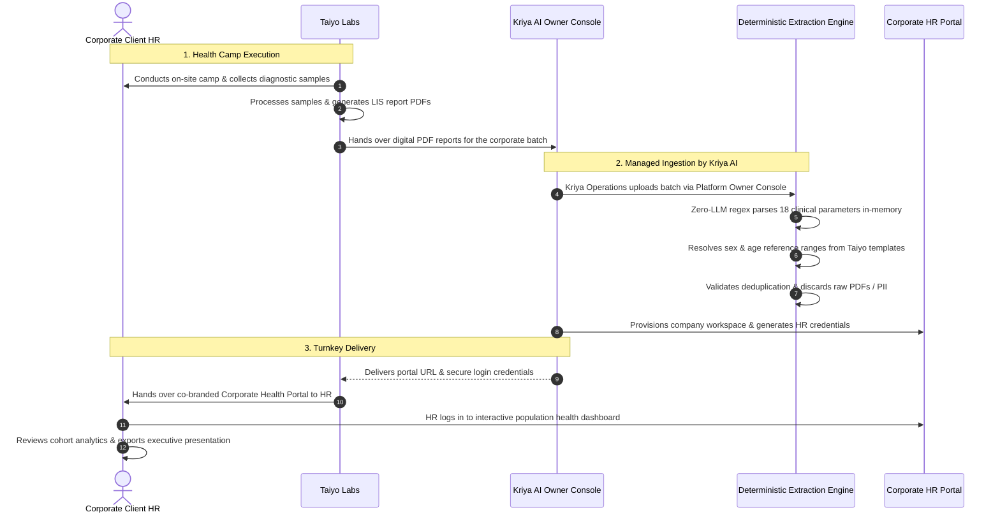

# KRIYA AI & TAIYO LABS
## STRATEGIC PARTNERSHIP PROPOSAL: MANAGED CORPORATE HEALTH INSIGHTS
### Fully Managed Workforce Wellness Analytics & Enterprise Health Screening Service for Diagnostic Laboratories

---

**Document Reference:** KAI-PRP-2026-TL-002  
**Issuing Organization:** Kriya AI (Healthcare Operations Technologies)  
**Target Partner:** Taiyo Labs (Pathology, Diagnostics & Preventive Care)  
**Service Model:** Fully Managed Corporate Health Analytics as a Service (MaaS)  
**Operational Responsibility:** Managed End-to-End by Kriya AI via Platform Owner Console  
**Regulatory Compliance:** India Digital Personal Data Protection (DPDP) Act 2023 · NMC Clinical Ethics  

---

## 1. Executive Summary

Diagnostic laboratories conducting corporate annual health checkup camps and executive wellness screenings face an evolving commercial expectation: **corporate human resources (HR) directors, employee wellness committees, and CXOs no longer accept hundreds of isolated individual PDF reports.** 

Corporate clients demand high-level, macro health intelligence:
* What percentage of our workforce exhibits early markers of cardiovascular risk, dyslipidemia, or pre-diabetes?
* How does organ-system and metabolic health correlate across age brackets and gender cohorts?
* Where should corporate health insurance, wellness stipends, and preventive interventions be targeted to reduce health risk and absenteeism?

Historically, diagnostic labs attempting to satisfy this demand have been forced into a costly operational trap: hiring administrative staff or pathologists to manually transcribe hundreds of PDF reports into spreadsheets. This process takes days, introduces human transcription errors, and creates severe data-leakage liability under the **Digital Personal Data Protection (DPDP) Act 2023**.

### The Solution: A Fully Managed Partnership with Kriya AI
Kriya AI proposes an **exclusive, fully managed Corporate Health Analytics Partnership** for Taiyo Labs:

* **Zero Operational Burden for Taiyo Labs:** Taiyo Labs does not need to operate any software, train laboratory staff, or manage cloud portals. Taiyo focuses entirely on its core competency: phlebotomy, diagnostic testing, and generating standard digital LIS reports.
* **Operated & Managed End-to-End by Kriya AI:** The entire data ingestion, deterministic clinical extraction, quality validation, deduplication, and portal setup is managed directly by Kriya AI operations through the **Kriya Platform Owner Console**.
* **Turnkey Credential Issuance:** Kriya AI configures the client company's dedicated workspace and generates secure **Corporate HR Portal credentials** on behalf of Taiyo Labs, ready to be handed directly to client HR leadership.
* **Zero Infrastructure & Zero Meta Requirements:** Taiyo Labs operates as an isolated **Corporate Partner Account**. You require no WhatsApp Business API setups, no Meta verifications, and no OPD appointment modules.

```
┌─────────────────────────────────────────────────────────────────────────────────────────────┐
│                             THE FULLY MANAGED PARTNERSHIP MODEL                             │
├───────────────────────────────┬───────────────────────────────┬─────────────────────────────┤
│          TAIYO LABS           │           KRIYA AI            │       CORPORATE CLIENT      │
│     (Diagnostic Partner)      │      (Managed Operations)     │       (Company HR / CXO)    │
├───────────────────────────────┼───────────────────────────────┼─────────────────────────────┤
│ • Executes health camp        │ • Receives batch PDFs from    │ • Receives secure login     │
│ • Conducts diagnostic tests   │   Taiyo Labs                  │   credentials               │
│ • Exports standard LIS PDFs   │ • Operates batch ingestion    │ • Views population health   │
│ • Hands batch PDFs to Kriya   │   via Platform Owner Console  │   macro dashboards          │
│ • Maintains primary client    │ • Parses 18 clinical markers  │ • Filters by age & gender   │
│   commercial relationship     │ • Generates HR credentials    │ • Exports executive reports │
│   and billing                 │ • Guarantees DPDP compliance  │   for leadership & board    │
└───────────────────────────────┴───────────────────────────────┴─────────────────────────────┘
```

---

## 2. Operational Architecture: How It Works

The partnership is structured so that Taiyo Labs gains an enterprise-tier corporate product without adding a single minute of administrative work to its laboratory staff:



### Detailed Operational Steps:

#### Step 1: Health Camp Execution (Taiyo Labs)
Taiyo Labs conducts the health screening camp at the client organization (or across Taiyo collection centres). As tests are verified in Taiyo’s existing Laboratory Information System (LIS), individual patient reports are generated in standard digital PDF format.

#### Step 2: Batch Handover to Kriya AI
At the conclusion of the camp, Taiyo Labs transfers the batch of digital report PDFs (e.g., 200 to 1,000 files) to Kriya AI via a secure transfer channel. 

#### Step 3: Platform Processing & Quality Verification (Kriya AI)
Kriya AI’s operational team logs into the **Kriya Platform Owner Console** (`/platform-panel`):
* Kriya AI selects **Taiyo Labs** as the host partner account.
* A dedicated company workspace is provisioned (e.g., *"Infosys Hyderabad – 2026 Annual Executive Camp"*).
* Kriya AI runs the automated batch ingestion. The engine parses the reports sequentially, verifies deduplication by bill number, validates dynamic reference ranges, and flags any non-standard pages.
* Kriya AI conducts an audit review to verify that 100% of tested parameters are properly classified.

#### Step 4: Credential Issuance & Turnkey Delivery (Kriya AI → Taiyo Labs → HR)
Directly from the Platform Owner Console, Kriya AI provisions dedicated **Corporate Client Viewer credentials** (`CORPORATE_VIEWER` role). Kriya AI delivers the access URL and credentials to Taiyo Labs, which passes them to the corporate client’s HR director or Chief Human Resources Officer (CHRO).

---

## 3. Core Capabilities Delivered by Kriya AI

### 3.1. Zero-LLM Deterministic Clinical Extraction Engine
Corporate medical data requires absolute mathematical accuracy. Kriya AI utilizes a **deterministic line-oriented regex parser** running directly over native digital PDF text layers:
* **Zero Clinical Hallucination:** No generative AI models or probabilistic text generators are involved. Every single extracted number matches the patient's lab slip with 100% mathematical fidelity.
* **Zero API Cost & High Speed:** Ingestion processes ~300 patient reports in approximately 5 minutes.
* **Sex-Specific Reference Range Extraction:** The parser extracts the exact reference ranges printed on Taiyo Labs' reports, dynamically accounting for biological sex (e.g., Hemoglobin 13–17 g/dL for males vs. 11–15 g/dL for females; ESR 0–10 mm/hr for males vs. 0–15 mm/hr for females).
* **Multi-Tier Normality Resolution:** Complex panels such as Vitamin D (featuring deficiency, insufficiency, and sufficiency thresholds) are resolved down to the true clinical sufficiency band.
* **Safe Degradation:** Non-standard layouts or tests with ambiguous unit structures are flagged as `unclassified`—counted in total tests administered, but safely excluded from normal/abnormal percentages to preserve clinical validity.

### 3.2. Automated Deduplication & Integrity Assurance
* **Bill-Level Deduplication:** Every record is bound to a unique `(clinic_id, company_id, bill_id)` constraint. If duplicate files or re-issued reports are uploaded, the engine automatically recognizes existing bill IDs and updates or skips them, ensuring camp statistics are never artificially inflated.
* **Scan & Text Validation:** Scanned image-only PDFs or improperly concatenated multi-patient files are immediately flagged with clear reason codes, allowing fast rectification before client presentation.

### 3.3. Dedicated Corporate Client HR Portal (`CORPORATE_VIEWER`)
When the client’s HR leadership logs into their dedicated portal, they enter an interactive, executive analytics workspace:
* **Cohort Breakdown & Filtering:** Real-time cohort cross-filtering by biological sex and age brackets (<30, 30–45, 45–60, 60+).
* **Organ-System Risk Stratification:** Immediate visualization of workforce health risk across metabolic, cardiovascular, hepatic, renal, endocrine, and micronutrient profiles.
* **Small-Cohort Privacy Guard:** To prevent inadvertent identification of individual employees in small companies or sub-departments, any filter combination yielding fewer than 10 individuals automatically displays an active privacy protection warning.
* **Executive Export & Presentation Mode:** One-click generation of formatted, board-ready Print/PDF summaries and anonymized CSV exports for corporate insurance wellness negotiations.

---

## 4. Comprehensive Clinical Coverage: 18 Parameters Across 6 Panels

Kriya AI extracts, analyzes, and stratifies 18 vital clinical parameters across 6 high-impact diagnostic panels that matter most to corporate wellness committees and health insurance providers:

| Diagnostic Panel | Clinical Parameter | Unit | What Kriya AI Tracks & Classifies |
| :--- | :--- | :--- | :--- |
| **Complete Blood Count (CBC)** | Hemoglobin (Hb%) | g/dL | Anemia detection, sex-specific reference thresholds |
| | ESR (Erythrocyte Sedimentation Rate) | mm/hr | Systemic inflammation & occupational strain marker |
| **Diabetic Profile** | Fasting Blood Sugar (FBS) | mg/dL | Baseline glycemic status (Normal, Pre-diabetic, Diabetic) |
| | HbA1c (Glycated Hemoglobin) | % | 90-day glycemic control & longitudinal diabetes risk |
| **Lipid & Cardiovascular** | Total Cholesterol | mg/dL | Dyslipidemia and primary cardiovascular screening |
| | Triglycerides | mg/dL | Metabolic risk and dietary lipid abnormalities |
| **Liver Function (LFT)** | Total Bilirubin | mg/dL | Hepatic clearance and jaundice risk |
| | SGOT (AST) | U/L | Hepatocellular and muscular enzyme integrity |
| | SGPT (ALT) | U/L | Specific marker for liver inflammation and fatty liver |
| | Total Protein | g/dL | Nutritional status and hepatic synthesis capacity |
| **Kidney Function (KFT)** | Serum Creatinine | mg/dL | Renal filtration capacity and baseline kidney health |
| | Blood Urea | mg/dL | Protein catabolism and renal clearance |
| **Vitamins & Micronutrients**| Vitamin D (25-OH) | ng/mL | Desk-worker sunshine deficiency & bone metabolic health |
| | Vitamin B12 | pg/mL | Neurological health, vegan/vegetarian deficiency screening |
| | Serum Calcium | mg/dL | Bone mineral density and neuromuscular electrolyte health |
| **Thyroid Profile** | Total T3 | ng/dL | Metabolic regulation and thyroid hormone level |
| | Total T4 | µg/dL | Peripheral thyroid endocrine balance |
| | TSH (Ultrasensitive) | µIU/mL | Primary screening for subclinical hypo/hyperthyroidism |

---

## 5. Data Privacy & India DPDP Act 2023 Compliance

Sharing employee medical records with an employer poses severe legal, ethical, and regulatory liabilities under India's **Digital Personal Data Protection (DPDP) Act 2023** and National Medical Commission (NMC) regulations. 

Kriya AI’s architecture is engineered from the ground up to **guarantee absolute privacy compliance**, shielding both Taiyo Labs and your corporate clients:

```
                    ┌──────────────────────────────────────────────┐
                    │            INCOMING PDF REPORT               │
                    │   (Employee Name, Phone, Address, Report)   │
                    └──────────────────────┬───────────────────────┘
                                           │
                                           ▼
                    ┌──────────────────────────────────────────────┐
                    │    IN-MEMORY EPHEMERAL EXTRACTION ENGINE     │
                    │   • Reads clinical parameters in RAM         │
                    │   • Extracts Sex, Age, Bill ID, 18 Results   │
                    │   • IMMEDIATELY DISCARDS Raw PDF and PII     │
                    └──────────────────────┬───────────────────────┘
                                           │
                                           ▼
                    ┌──────────────────────────────────────────────┐
                    │         STRUCTURED ANONYMIZED DATABASE       │
                    │     (Only ~0.6 KB per record stored)         │
                    │   • ZERO Employee Names                      │
                    │   • ZERO Contact Information                 │
                    │   • ZERO Stored PDF Files                    │
                    └──────────────────────────────────────────────┘
```

1. **Zero Raw-PDF Storage:** Neither Kriya AI nor the database ever writes the uploaded PDF reports or scanned images to disk or cloud storage buckets. The file is streamed into memory, parsed, and immediately destroyed.
2. **Zero Employee PII Stored:** Employee names, phone numbers, employee ID codes, and residential addresses are intentionally discarded before database persistence. The system stores only biological age, biological sex, camp date, bill ID (for deduplication), and the 18 numerical outcomes.
3. **Data Minimization Standard:** Each employee health record consumes approximately **0.6 KB** of structured database space. A camp of 1,000 employees consumes merely ~0.6 MB, minimizing data liability.
4. **Server-Enforced Access Lockdown:** The corporate viewer login is locked down at the HTTP routing layer. The server strictly forbids company accounts from accessing any clinical or laboratory administrative endpoints.
5. **Complete Right to Erasure:** At the conclusion of a corporate contract or camp cycle, Kriya AI can delete an entire company’s dataset in a single transaction with cascading cleanup.

---

## 6. What Kriya AI Delivers to Taiyo Labs

Under this managed partnership, Kriya AI delivers an all-inclusive, fully operational service:

| Operational Area | What Kriya AI Delivers & Manages |
| :--- | :--- |
| **Concierge Data Operations** | • Ingestion of all corporate camp PDF reports managed directly by Kriya AI.<br>• Automated deduplication, parsing, and clinical data verification.<br>• Quality-assurance review to confirm 100% parameter classification. |
| **Partner Account Management** | • Dedicated **Corporate Partner Account** provisioned for Taiyo Labs.<br>• Zero WhatsApp, Meta, or appointment scheduling overhead.<br>• Isolated laboratory tenant architecture with complete data segregation. |
| **Client Workspace & Credential Issuance** | • Creation of unlimited corporate company workspaces in the Platform Owner Console.<br>• Generation and issuance of secure login credentials for corporate HR teams.<br>• Password reset and account maintenance managed by Kriya AI. |
| **Corporate HR Portals** | • Presentation-ready, branded Population Health Dashboards for your clients.<br>• Cross-cohort risk filtering by age, gender, and organ systems.<br>• Built-in Small-Cohort Privacy Protection for groups under 10.<br>• Formatted Print/PDF and anonymized CSV data export tools. |
| **LIS Template Calibration** | • Continuous calibration of the extraction engine to Taiyo Labs' specific LIS report formats.<br>• Support for multi-page layouts and customized diagnostic panels. |
| **Security & Compliance SLA** | • 100% compliance with India DPDP Act 2023 (Zero-PII, Zero-PDF architecture).<br>• High-availability cloud infrastructure with encrypted data in transit and at rest. |

---

## 7. Strategic Value for Taiyo Labs

```
┌─────────────────────────────────────────────────────────────────────────────────────────────┐
│                             WHY TAIYO LABS WINS WITH KRIYA AI                               │
├─────────────────────────────────────────────────────────────────────────────────────────────┤
│ 🏆 WIN HIGH-VALUE CORPORATE TENDERS                                                         │
│    Stand out from competing diagnostic chains by offering an executive population health    │
│    analytics dashboard alongside your clinical tests — at zero extra software effort.       │
│                                                                                             │
│ ⏱️ ZERO OPERATIONAL & MANPOWER OVERHEAD                                                     │
│    Eliminate days of manual data entry into Excel sheets. Kriya AI manages the entire       │
│    upload and credential issuance pipeline on your behalf.                                  │
│                                                                                             │
│ 🛡️ 100% LEGAL & REGULATORY PROTECTION                                                       │
│    Deliver actionable macro health intelligence to corporate leadership without ever        │
│    disclosing individual employee medical results or violating DPDP Act 2023 regulations.   │
│                                                                                             │
│ 🤝 HIGH CORPORATE CLIENT RETENTION                                                          │
│    HR directors and CXOs become dependent on Taiyo Labs' annual health analytics to         │
│    plan insurance policies, wellness programs, and executive health benefits year after year.│
└─────────────────────────────────────────────────────────────────────────────────────────────┘
```

---

## 8. Turnkey Onboarding & Pilot Rollout

Because Kriya AI manages the entire operational lifecycle, Taiyo Labs can go live without any software installation, technical training, or hardware integration:

```
┌─────────────────────────────────────────────────────────────────────────────┐
│                           TURNKEY ROLLOUT TIMELINE                          │
├─────────────────────┬───────────────────────────────────────────────────────┤
│ Phase 1: Alignment  │ Taiyo Labs shares 3–5 sample anonymized LIS report   │
│ (Days 1–2)          │ PDFs. Kriya AI fine-tunes parser regex calibration.   │
├─────────────────────┼───────────────────────────────────────────────────────┤
│ Phase 2: Partner    │ Kriya AI provisions Taiyo Labs' Corporate Partner     │
│ Setup (Day 3)       │ Account in the Kriya Platform Owner Console.          │
├─────────────────────┼───────────────────────────────────────────────────────┤
│ Phase 3: Pilot Camp │ Taiyo Labs hands over reports from a recent camp.     │
│ (Days 4–5)          │ Kriya AI ingests reports and generates the live       │
│                     │ Corporate HR Dashboard for joint executive review.    │
├─────────────────────┼───────────────────────────────────────────────────────┤
│ Phase 4: Production │ Full rollout for all corporate screening camps and   │
│ (Go-Live)           │ executive health checkup contracts.                   │
└─────────────────────┴───────────────────────────────────────────────────────┘
```

---

*For technical alignment or to schedule the Phase 3 pilot ingestion, please contact the Kriya AI executive engineering team.*
