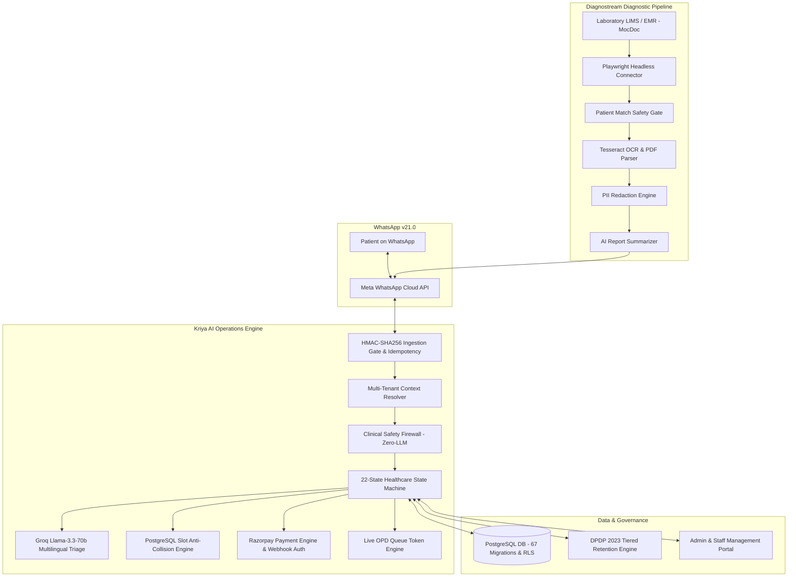

# KRIYA AI — INTELLIGENT HEALTHCARE OPERATIONS PLATFORM
## ENTERPRISE CLIENT PROPOSAL & SYSTEM SPECIFICATION

**Proposal Type:** Enterprise Commercial Solution Proposal & Operational Blueprint  
**Platform:** Kriya AI v2.0.0 (Powered by XylarcAI)  
**Target Organization:** Enterprise Hospital Networks, Multispecialty Clinics, Diagnostic Laboratory Chains & Private Medical Centers  
**Commercial Terms:** Capability, Scale, and Workflow Depth Tiered (Zero Monetary Pricing Included)  
**Compliance Standards:** India DPDP Act 2023 · NMC Medical Ethics Guidelines · HL7 FHIR R4  

---

## 1. Executive Summary

Modern healthcare facilities operate in an increasingly demanding environment where patient satisfaction is dictated by accessibility and speed of service. However, outpatient departments (OPDs) and diagnostic laboratories remain burdened by manual administrative friction: jammed front-desk phone lines, crowded waiting halls, high appointment no-show rates, delayed lab report handoffs, and disconnected legacy software.

**Kriya AI** is an enterprise-grade, multi-tenant healthcare operations platform that turns WhatsApp into a 24/7 autonomous digital front desk. Designed specifically for Indian healthcare environments, Kriya AI automates the entire outpatient lifecycle:
* **Natural Language Symptom Triage & Booking:** Multilingual conversational scheduling in English, Hindi, and Telugu with zero patient app downloads.
* **ACID-Protected Slot Engine:** Concurrency-guarded dynamic scheduling that eliminates double-booking race conditions.
* **Integrated Cashless Payments:** Automated Razorpay UPI and card payment pre-collection with 10-minute temporary holds.
* **Live Waiting Room Queue Tracking:** Sequential digital token allocation allowing patients to monitor their live consultation turn on WhatsApp.
* **Diagnostream Lab Automation:** Headless EMR/LIMS report scraping, OCR extraction, patient identity matching, PII-sanitized AI summaries, and authenticated PDF delivery.
* **Clinical & Regulatory Governance:** Zero-LLM deterministic clinical safety firewall protecting against medical liability and built-in Digital Personal Data Protection (DPDP) Act 2023 compliance.

Kriya AI coexists gracefully with your existing Hospital Management Information System (HMIS) or Laboratory Information System (LIMS), providing a frictionless digital front door that slashes front-desk workload by up to 80% while enhancing patient loyalty.

---

## 2. The Operational Problem Space

```
┌──────────────────────────────────────┬──────────────────────────────────────┐
│       CURRENT OPERATIONAL FRICTION   │         THE KRIYA AI TRANSFORMATION  │
├──────────────────────────────────────┼──────────────────────────────────────┤
│ • 70% of front-desk time consumed by │ • 24/7 automated self-service booking│
│   repetitive phone scheduling calls. │   deflects 60-80% of inbound calls.  │
│ • 20% to 35% OPD appointment slots   │ • Automated 24h & 2h WhatsApp alerts │
│   lost due to patient no-shows.      │   reduce no-shows by more than half. │
│ • Blind waiting rooms where patients │ • Live WhatsApp queue tokens allow   │
│   wait 45-90 minutes without clarity.│   patients to track their turn live. │
│ • Patients forced to make physical   │ • Diagnostream delivers verified lab │
│   trips solely to collect lab papers.│   PDFs & AI summaries on WhatsApp.   │
│ • Severe liability risk from generic │ • Zero-LLM deterministic firewall    │
│   AI bots giving medical advice.     │   guarantees clinical safety.        │
└──────────────────────────────────────┴──────────────────────────────────────┘
```

---

## 3. End-to-End Solution Architecture



---

## 4. Key Platform Capabilities

### 4.1 24/7 WhatsApp Outpatient Booking
* **Zero App Download:** Functions natively within WhatsApp, reaching 98% of Indian smartphone users.
* **Multilingual Fluency:** Fluent conversational interaction in English, Hindi, and Telugu.
* **Symptom-to-Department Triage:** AI understands natural language symptoms ("severe knee pain when walking") and guides the patient to the correct medical specialty (Orthopedics).
* **Family Dependent Management:** Allows a single phone number to manage profiles, bookings, and medical records for children, elderly parents, and spouses.

### 4.2 Dynamic Doctor Scheduling & Anti-Collision Engine
* **Doctor Roster Sovereignty:** Supports complex multi-shift consultation hours, departmental room allocations, and planned leave calendars.
* **PostgreSQL Partial Unique Slot Locks:** Eliminates double-booking race conditions through database ACID integrity constraints (`uq_appointments_slot_active`).
* **Automated Leave Handling:** When a doctor applies for leave, the system automatically flags affected appointments and initiates WhatsApp rescheduling workflows.

### 4.3 Integrated Cashless Payments
* **Direct UPI & Card Collection:** Generates Razorpay payment links with 10-minute temporary slot holds.
* **Flexible Payment Policies:** Configurable per clinic or doctor (Full Consultation Fee, Partial Deposit, or Free Walk-in Gating).
* **Cryptographic Reconciliation:** All transactions verified via SHA-256 HMAC webhooks and recorded in an immutable, append-only `payment_events` ledger.

### 4.4 Live Waiting Room Queue Management
* **Sequential Token Allocation:** Confirmed patients receive a digital queue token (e.g. `Q-014`).
* **Live WhatsApp Status Tracking:** Patients can check real-time queue status at any time (*"Current token with Dr. Sharma is Q-011. 3 patients ahead of you."*).
* **Receptionist Control Interface:** Front-desk staff advance tokens with a single click, instantly dispatching WhatsApp alerts to the next waiting patient.

### 4.5 Diagnostream — Automated Diagnostic Pipeline
* **Autonomous EMR Scraping:** Playwright connector polls lab systems (such as MocDoc) for authorized PDF reports.
* **Patient Match Safety Gate:** Fuzzy name similarity algorithms and phone verification prevent accidental dispatch to incorrect recipients.
* **PII-Sanitized AI Summary:** Redacts personal identifiers before generating a plain-language summary highlighting normal and abnormal parameters.
* **Instant Delivery:** Sends the authenticated PDF lab report directly to the patient’s WhatsApp with a single-click consultation CTA.

### 4.6 Administrative Portal & Healthcare Analytics
* **Role-Based Access Control (RBAC):** Granular interfaces for Super-Admins, Hospital Admins, Branch Managers, Doctors, and Receptionists.
* **Operational Business Intelligence:** Real-time dashboards displaying appointment conversion rates, daily revenue, doctor utilization, and no-show trends.
* **Patient Feedback Engine:** Automated post-consultation WhatsApp feedback collection for continuous service monitoring.

---

## 5. Plan Configurations (Zero Pricing Included)

| Plan Configuration | Ideal Operational Environment | Included Capabilities & Workflow Depth |
| :--- | :--- | :--- |
| **Solo Clinic** | Single Doctor / Private Practice | 24/7 WhatsApp Receptionist · Single Doctor Timetable · Direct Location & Directions · UPI Fee Pre-Collection · Automated Patient Reminders |
| **Essential** | Small Clinic / Primary Health Center | Up to 3 Doctors · Single Branch · Core Symptom AI Triage · Razorpay Payment Links · 24h & 2h Reminders · DPDP Consent Capture · Staff Dashboard |
| **PolyClinic** | Multi-Specialty Medical Center | Up to 25 Doctors · Up to 3 Branches · Multi-Specialty AI Triage · Dynamic Doctor Shifts · Live OPD Queue Tokens · Family Dependents · Multi-Role Admin |
| **Diagnostream** | Pathology Labs & Diagnostic Centers | Dedicated Diagnostic Pipeline · MocDoc/LIMS Scraping · OCR Extraction · Patient Match Safety Gate · PII-Sanitized AI Summary · WhatsApp PDF Delivery |
| **Enterprise** | Hospital Chains & Multi-Branch Groups | Unlimited Doctors & Branches · Multi-Branch Patient Routing · Centralized & Branch RBAC · HL7 FHIR R4 Integration · Custom EMR Adapters · 99.9% SLA |

---

## 6. Security, Privacy & Regulatory Compliance

### 6.1 Digital Personal Data Protection (DPDP) Act 2023
* **Explicit Conversational Consent:** Timestamped opt-in captured upon initial interaction.
* **Automated 30-Day Transcript Purge:** Background cron jobs purge conversation transcript PII after 30 days.
* **7-Year Statutory Medical Retention:** Core appointment logs, clinical doctor notes, and financial audit trails are preserved for 7 years per NMC requirements.
* **Right to Erasure:** Verified administrative endpoint for compliant patient profile deletion.

### 6.2 National Medical Commission (NMC) Liability Shield
* **Deterministic Clinical Firewall:** Zero-LLM regex interceptor blocks inquiries seeking drug prescriptions, dosages, or diagnostic medical advice, returning safe triage redirects to prevent institutional malpractice liability.

### 6.3 Bank-Grade Data Security
* **PostgreSQL Row-Level Security (RLS):** Database-level tenant isolation guarantees complete separation across clinic datasets.
* **Meta HMAC Webhook Authentication:** Rejects untrusted inbound HTTP traffic at the network edge.
* **Zero PCI-DSS Data Storage:** Financial transactions handled entirely through RBI-regulated Razorpay gateways.

---

## 7. Implementation & Onboarding Roadmap

Our structured 4-stage onboarding process ensures full production launch within **14 business days** with zero operational downtime:

```
┌─────────────────────────┬─────────────────────────┬─────────────────────────┬─────────────────────────┐
│ STAGE 1: PROVISIONING   │ STAGE 2: ROSTER SETUP   │ STAGE 3: EMR CONNECTOR  │ STAGE 4: GO-LIVE        │
│ (Days 1 to 3)           │ (Days 4 to 6)           │ (Days 7 to 10)          │ (Days 11 to 14)         │
├─────────────────────────┼─────────────────────────┼─────────────────────────┼─────────────────────────┤
│ • Meta WABA verification│ • Doctor profiles &     │ • Diagnostream EMR sync │ • Front-desk staff      │
│ • Dedicated tenant setup│   specialties uploaded  │ • OCR parsing validation│   training & playbooks  │
│ • Admin portal user     │ • Shift rosters & room  │ • Patient match safety  │ • Front-desk QR counter │
│   credentials issued    │   allocations locked    │   threshold testing     │   collateral placement  │
│ • Razorpay credentials  │ • Consultation payment  │ • Webhook signature and │ • Official production   │
│   configured in tenant  │   parameters activated  │   idempotency checks    │   launch & live support │
└─────────────────────────┴─────────────────────────┴─────────────────────────┴─────────────────────────┘
```

---

## 8. Expected Operational Outcomes (Modelled Impact)

* **60% to 80% Reduction** in front-desk scheduling phone calls.
* **50% to 70% Drop** in OPD appointment no-show rates via automated WhatsApp reminders.
* **90% Decrease** in diagnostic report status calls through Diagnostream automation.
* **100% Capture** of evening, weekend, and after-hours appointment inquiries.
* **Significant Decongestion** of hospital waiting rooms through live WhatsApp token tracking.

---

## 9. Next Steps: Commissioning a Departmental Pilot

We invite your executive and clinical leadership to validate Kriya AI in your live operational environment:
1. **Executive Live Demonstration:** Interactive walkthrough of patient booking, payment reconciliation, and Diagnostream lab report scraping.
2. **Scoping & Configuration Workshop:** Mapping your hospital's specific doctor shifts, specialty departments, and EMR infrastructure.
3. **Commission a Single-Department Pilot:** Deploy Kriya AI in one high-volume department (e.g. Pediatrics or General Medicine) or diagnostic center to benchmark operational gains before hospital-wide rollout.

**Contact XylarcAI Enterprise Solutions to schedule your demonstration and pilot commissioning.**
